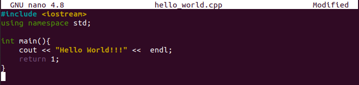
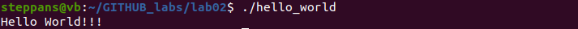
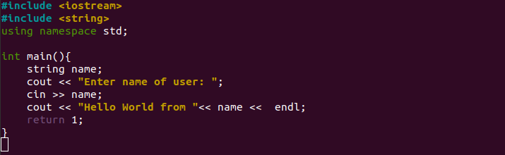
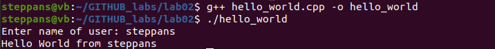
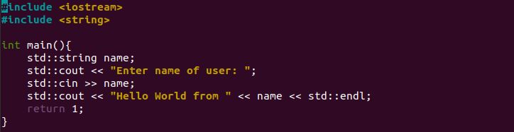
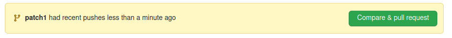
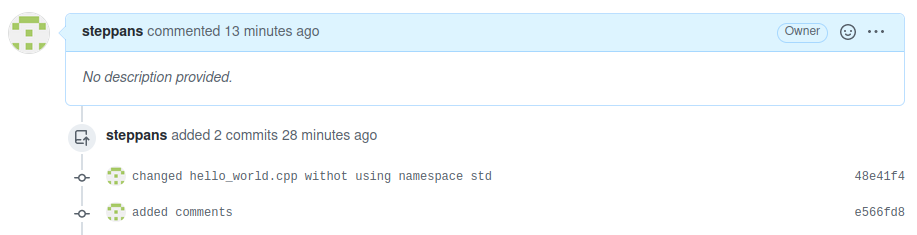
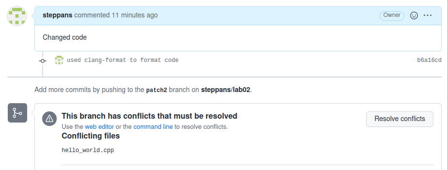
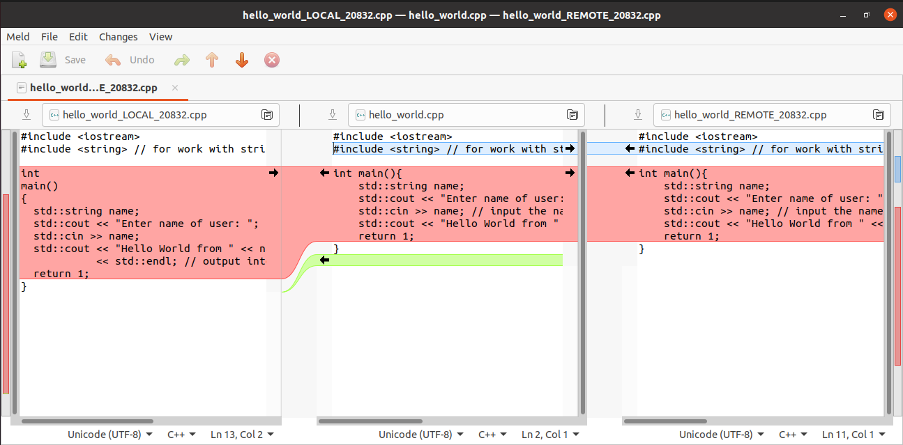

# Laboratory work 2
## Part I
1. Created new repository with `MIT license`, `README.md`, `.gitignore` and `hello_world.cpp`.
2. Implemented the program **Hello World**.

3. Then I changed `hello_world.cpp` for work with user.

 - Compiled programs with command `g++ hello_world.cpp -o hello_world`.
4. Commited new version using `git commit -a`.
5. Pushed all changes `git push -u origin main`.

## Part II
1. Created new branch **patch1** using `git branch patch1`.
2. Get out of `using namespace std`.

3. Created *pull request*.

4. Added commit of comments and push it on *github*.

5. Merged new branch with default and deleted *patch1* from remote and local repository.

## Part III
1. Created new branch `patch2`.
2. Installed utility `clang-format` to change code style.
 - Used `clang-format -i --style=Mozilla`.
3. Changed comments in *main* in remote repository.
4. In *pull request* appeared *conflicts*.

5. I fixed conflicts using `git mergetool` graphical tool **meld**.

6. Then I use `git push --force origin patch2` to make changes and modify history of last commit.
7. Conflicts were fixed. 

