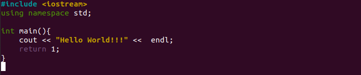

# Laboratory work 2
## Part I
1. Created new repository with `MIT license`, `README.md`, `.gitignore` and `hello_world.cpp`.
2. Implemented the program **Hello World**.

3. Then I changed `hello_world.cpp` for work with user.

 - Compiled programs with command `g++ hello_world.cpp -o hello_world`.
4. Commited new version using `git commit -a`.
5. Pushed all changes `git push -u origin main`.

## Part II
1. Created new branch **patch1** using `git branch patch1`.
2. Get out of `**using namespace** std`.

3. Created *pull request*.

4. Added commit of comments and push it on *github*.

5. Merged new branch with default and deleted *patch1* from remote and local repository.

